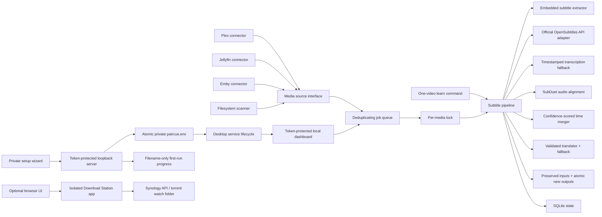

# SubDuet architecture

SubDuet is a media-server companion service, not a replacement for Plex, Jellyfin, Emby, Bazarr,
Sonarr, or Radarr.

## Requirements and assumptions

- One NAS or home server, normally one worker.
- A library can contain thousands of movies and episodes.
- Translation is slower and more failure-prone than local file operations.
- A partial subtitle is worse than no translated subtitle.
- Download Station is useful, but it must not share media-server or media-library privileges.

## Components

The subtitle service mounts `/media` and receives only the selected media-server and translation
credentials. The Download Station service mounts only `/torrents` and receives only Download
Station credentials. They use different bearer tokens and ports.

The setup wizard is packaged with SubDuet and is served only on a random `127.0.0.1` port. Its
one-time random URL token and same-origin check protect the configuration write. It loads no remote
assets, performs no analytics, writes `paircue.env` with owner-only permissions, and backs up an
existing regular file before replacement. The `learn` command reuses the same pipeline with
temporary state and a media root restricted to the selected video's parent directory.

Desktop releases freeze the same independently written Python application and packaged local setup
assets into a self-contained operating-system app. They store configuration in the user's native
application-data folder, contain the runtime license bundle and SBOM, and deliberately exclude
FFmpeg, provider models, subtitles, and media.

When desktop library mode is selected, SubDuet first makes a bounded authenticated platform check,
then starts the same core runtime on `127.0.0.1`. The dashboard receives its bearer token in a URL
fragment, removes that fragment from browser history before its first API request, keeps the token
only in page memory, and returns filename-only results. Stopping or editing from the dashboard
shuts the runtime down cleanly before the next action.

Desktop Quick Pair is a separate zero-configuration path inside the same tokenized setup origin.
The operating system chooses both SRT inputs, the existing independent timing matcher writes a new
non-overwriting bilingual file, and only its filename and match ratios return to the browser. New
bilingual sidecars use the standard ISO 639-2 `mul` language tag; `cc` is not used because supported
media servers reserve it for hearing-impaired captions.

## Processing contract

1. Discover the item through the selected connector, map its path under the configured media root,
   and reject paths outside it.
2. Deduplicate the queue and take a lock for the media path.
3. Extract text-based embedded subtitles matching the configured source or target language.
4. When both language tracks exist, copy each to a temporary working directory, synchronize those
   copies against the media, and merge by temporal connected components. Never assume cue numbers
   or counts match, and never mutate the user-owned tracks by default.
5. Require the configured timing-coverage threshold in both tracks before publishing the merged
   bilingual file. This handles one-to-many cue segmentation without silently accepting unrelated
   subtitle releases.
6. Otherwise, download the configured source subtitle when required and synchronize it. If search
   fails and transcription is enabled, segment the media audio, request timestamped speech
   transcription, and atomically publish a generated source SRT only after every chunk succeeds.
7. Remove non-dialogue cues from the in-memory translation source.
8. Translate in bounded batches. A batch is accepted only when every requested ID appears exactly
   once with non-empty text. Use the fallback provider only after the primary exhausts its retries.
9. Validate complete coverage across the whole file.
10. Write a missing target-language output and then the bilingual learning output using atomic
   replacements. An existing bilingual output is never overwritten; it is the completion marker.
11. Record the result in SQLite.

## Trade-offs

- The first release uses one worker. This is intentionally slower than unrestricted parallelism but
  avoids duplicate translation costs and NAS I/O spikes.
- SQLite is sufficient for one host and keeps installation simple. A distributed queue and database
  should only be considered if SubDuet later supports multiple workers.
- Polling is enabled by default on every connector. Webhooks are optional and must supply SubDuet's
  bearer token directly or through a trusted reverse proxy.
- Download Station remains in the repository for convenience but runs as a separate process with a
  separate privilege boundary.

## Revisit when the project grows

- Incremental connector cursors and event replay for very large libraries.
- Translation cache keyed by source text, model, prompt version, and glossary version.
- Per-library and per-series language-learning profiles.
- Structured logs, optional external monitoring, and long-term activity history.
- Multiple workers backed by a durable external queue.
