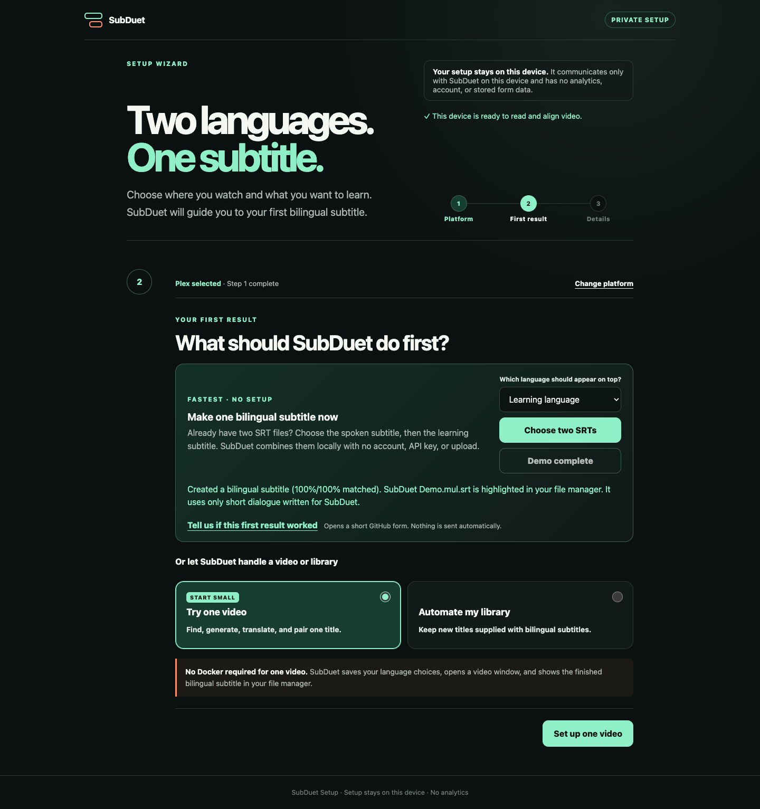

<p align="center">
  
</p>

<h1 align="center">SubDuet</h1>

<p align="center"><strong>Two languages. One subtitle.</strong></p>

<p align="center">
  Turn a private media library into a bilingual learning library — with two subtitle languages
  in the player you already use.
</p>

<p align="center">
  <a href="https://github.com/NLINEA/SubDuet/actions/workflows/ci.yml"></a>
  <a href="https://github.com/NLINEA/SubDuet/releases"></a>
  <a href="LICENSE"></a>
  
</p>

<p align="center">
  <a href="https://github.com/NLINEA/SubDuet/releases"><strong>Download the beta</strong></a>
  · <a href="#see-it-before-setup">See the safe demo</a>
  · <a href="https://github.com/NLINEA/SubDuet">Star SubDuet</a>
</p>

<p align="center"><a href="README.md">English</a> · <a href="README.zh-HK.md">繁體中文</a></p>

<p align="center">
  Built by <a href="https://unbounds.co/nlinea/">NLINEA</a> ·
  A project of <a href="https://unbounds.co/">The Unbound Company</a> ·
  <a href="https://unbounds.co/nlinea/subduet/">Project case study</a>
</p>


SubDuet is the bridge between a private media collection and language learning. It finds or
generates missing subtitles, translates when needed, aligns two tracks by time, and saves one
portable `Movie.mul.srt` beside the video.

No custom player. No browser extension. No SubDuet account. No analytics.

> SubDuet is beta software. Start with the safe demo, two SRT files, or a copy of one video.

Previously **PairCue**. This is the same project with a new name. Existing settings and the
`paircue` command still work; see [Upgrading from PairCue](docs/RENAMING.md).

## Why SubDuet

| What matters | SubDuet's approach |
|---|---|
| **Any useful language pair** | Source and learning languages are independent; support depends on your files or chosen provider |
| **Your existing player** | The result is an ordinary bilingual SRT for Plex, Jellyfin, Emby, Kodi, Infuse, VLC, and more |
| **A first result without setup** | The owned demo needs no media, server, account, key, FFmpeg, or network |
| **Local and reversible** | Existing subtitle files are aligned through temporary copies and stay unchanged by default |

If SubDuet would make your library more useful, star the project. It helps other language learners
discover it while the beta is still small.

## See it before setup

Open SubDuet and press **Try safe demo**. It creates this project-owned English–Spanish result in
your Downloads folder without reading your library or making a network request:

```srt
1
00:00:01,000 --> 00:00:03,520
¿Por dónde empezamos?
Where should we begin?
```

The [complete synthetic demo](examples) belongs to SubDuet and can be regenerated locally.



## Download and open

No Python or terminal is required. Download, unzip, then open **SubDuet**.

| Your computer | Beta download |
|---|---|
| Apple silicon Mac | [SubDuet for Apple silicon](https://github.com/NLINEA/SubDuet/releases/download/v0.1.0b15/SubDuet-macOS-arm64.zip) |
| Intel Mac | [SubDuet for Intel Mac](https://github.com/NLINEA/SubDuet/releases/download/v0.1.0b15/SubDuet-macOS-x64.zip) |
| Windows | [SubDuet for Windows](https://github.com/NLINEA/SubDuet/releases/download/v0.1.0b15/SubDuet-windows-x64.zip) |
| Linux | [SubDuet for Linux](https://github.com/NLINEA/SubDuet/releases/download/v0.1.0b15/SubDuet-linux-x64.tar.gz) |

The beta apps are not yet signed. On macOS, right-click SubDuet and choose **Open** the first time.
Windows may show an unrecognized-publisher warning. Download only from this repository; every
release includes `SHA256SUMS.txt`.

## Choose your first result

SubDuet asks where you watch first, then reveals only what your chosen result needs.

| Start here | Bring | Get |
|---|---|---|
| **Try safe demo** | Nothing | A tiny owned bilingual SRT |
| **Choose two SRTs** | Two language tracks | A new aligned `.mul.srt`; both inputs stay untouched |
| **Try one video** | One local video | Reused, found, generated, or translated subtitles plus `.mul.srt` |
| **Automate my library** | A folder or Plex, Jellyfin, or Emby connection | New videos processed in the background |

The shortest useful path is **Choose two SRTs**. Select the subtitle spoken in the video, then the
language you want to read or learn. SubDuet refuses to publish the result when timing confidence is
too low.

For command-line users:

```bash
subduet pair Movie.ja.srt Movie.en.srt -o Movie.mul.srt
```

## How one video becomes bilingual

SubDuet takes the least invasive route that can produce a complete result:

```text
existing tracks → optional subtitle search → optional speech generation
                → timing alignment → optional translation → AI final check → Movie.mul.srt
```

- Two existing languages are paired without a translation provider.
- Search uses the documented OpenSubtitles.com API and your own account or key.
- Speech generation and translation are opt-in and use the endpoint you configure.
- When enabled, the AI final check reviews the draft through that same translation connection.
- A translation is published only when every cue passes both completeness checks.
- A previous bilingual output is never overwritten.

FFmpeg is optional and not bundled. Pairing two SRT files, the safe demo, search, and translation
can work without it. Embedded-subtitle extraction, audio alignment, and speech generation need a
separate FFmpeg installation.

## Languages and players

English and Chinese are defaults, not limits. Use Japanese + English, English + Japanese,
Spanish + French, `zh-HK` + English, or another pair supported by your subtitle files or provider.
Choose which language appears on top. Regional tags and custom wording guidance are supported.

`Movie.mul.srt` uses the standard multilingual language tag and remains a normal sidecar subtitle.
The media servers below can be discovered directly; other players simply read the finished file.

| Library source | Discovery | New-item trigger |
|---|---|---|
| Plex | Authenticated library API | Polling or native webhook |
| Jellyfin | Authenticated user-items API | Polling or Webhook Plugin |
| Emby | Authenticated user-items API | Polling or webhook |
| Kodi, Infuse, VLC, NAS, or folders | Recursive file scan | Polling |

## Privacy is part of the product

- The setup and dashboard stay on this device and load no remote app assets.
- SubDuet has no account, analytics SDK, or automatic telemetry.
- Existing SRT files remain byte-for-byte unchanged by default, including during audio alignment.
- Automated gates check tracked files, Git history, and release packages for common credential and
  private AI-context patterns without printing suspected values.
- Media stays local unless you explicitly enable a transcription provider; subtitle dialogue stays
  local unless you explicitly enable search or translation.
- AI requests never include video, local paths, media-server credentials, or API keys in their
  request body. Remote AI endpoints must use HTTPS; loopback AI can run without a key.
- Each release runs tests, dependency vulnerability and license checks, and includes an SBOM plus
  checksums.

Provider features are governed by that provider's terms, privacy policy, retention, and pricing.
Read [Security](SECURITY.md) before exposing any service beyond a trusted home network.

## Help, docs, and direction

New here? Start with the [10-minute beta mission](docs/BETA_TEST.md) or
[Troubleshooting](docs/TROUBLESHOOTING.md).

- [Documentation map](docs/README.md)
- [Configuration and language examples](docs/CONFIGURATION.md)
- [Docker and NAS](docs/DOCKER.md)
- [Support and safe bug reporting](SUPPORT.md)
- [Public roadmap](ROADMAP.md)
- [Architecture and trust boundaries](ARCHITECTURE.md)
- [Contributing](CONTRIBUTING.md)
- [Release changes](CHANGELOG.md)

Questions belong in [GitHub Discussions](https://github.com/NLINEA/SubDuet/discussions).
For a reproducible problem, use the guided
[bug form](https://github.com/NLINEA/SubDuet/issues/new?template=bug_report.yml). Nothing is
collected automatically. Never post credentials, private paths, library screenshots, or subtitle
content you do not have permission to share.

## Build from source

SubDuet requires Python 3.11 or newer:

```bash
python3 -m pip install .
subduet
```

Check a saved configuration without displaying secrets using `subduet doctor`. See
[Contributing](CONTRIBUTING.md) for the development environment and full test suite.

## Independent and open

SubDuet is independently implemented and is not affiliated with Plex, Jellyfin, Emby, Synology,
subtitle providers, or model providers. Copied or closely adapted code from other subtitle products
is not accepted.

[MIT](LICENSE). Dependency, FFmpeg, provider, and content boundaries are documented in
[Dependency policy](DEPENDENCY_POLICY.md) and [Third-party notices](THIRD_PARTY_NOTICES.md).
