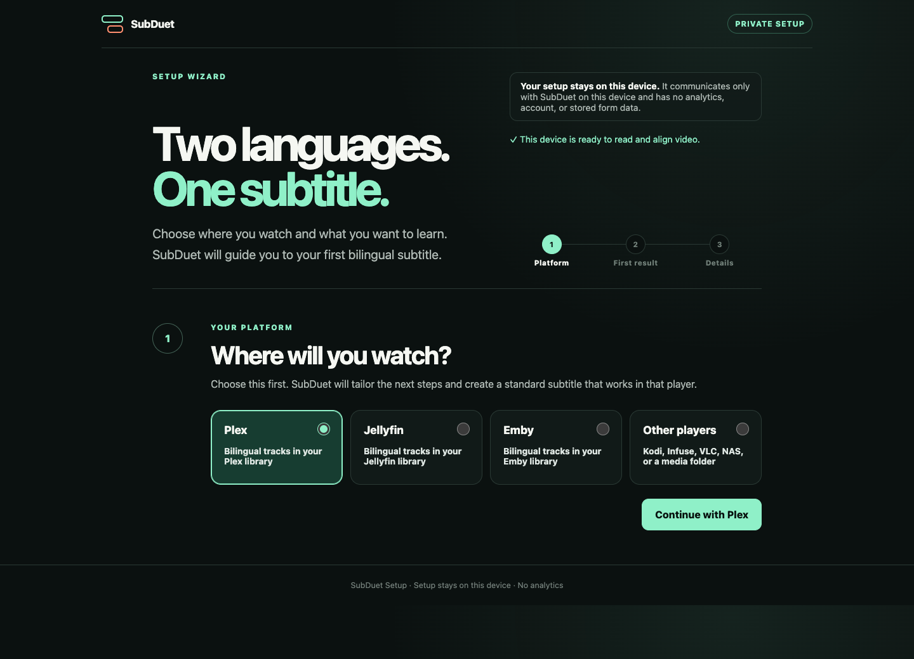

  

<h1 align="center">SubDuet</h1>

<strong>兩種語言，一份字幕。</strong>

  將私人電影同劇集變成雙語學習片庫，繼續用你本身嘅播放器。

  <a href="https://github.com/NLINEA/SubDuet/releases"><strong>下載 Beta</strong></a>
  · <a href="#完全唔識用由呢度開始">新手開始</a>
  · <a href="README.md">English</a>

SubDuet 會重用、搜尋或由音訊生成字幕，按時間對位，需要時翻譯，再用 AI 做最後品質
檢查，最後喺影片旁邊建立一份普通嘅 `Movie.mul.srt`。

唔使轉播放器、唔使裝瀏覽器插件、唔使開 SubDuet 帳戶，亦冇自動數據追蹤。

> SubDuet 仍然係 Beta。第一次請用安全示範、兩份 SRT，或者一條影片副本。

SubDuet 原名 **PairCue**，係同一個專案。舊設定同 `paircue` 指令繼續可用，唔需要重新
輸入 API Key。詳情見 [由 PairCue 升級](docs/RENAMING.md)。

## 完全唔識用？由呢度開始

1. 喺 [Releases](https://github.com/NLINEA/SubDuet/releases) 下載你部電腦嘅版本。
2. 解壓後開啟 **SubDuet**。
3. 先揀你平時用嘅平台：Plex、Jellyfin、Emby，或者其他播放器／資料夾。
4. 撳 **Try safe demo**。

安全示範唔會讀你嘅片庫，亦唔需要影片、伺服器、帳戶、API Key、FFmpeg 或網絡。成功
後，Downloads 會出現一份由本專案自行創作內容生成嘅雙語字幕。

## 四種用法

| 你想要嘅結果 | 你要準備 | SubDuet 會做 |
|---|---|---|
| **先睇安全示範** | 乜都唔使 | 建立一份細小、原創嘅雙語 SRT |
| **整合兩份字幕** | 兩種語言嘅 SRT | 按時間對齊，另存全新 `.mul.srt` |
| **試一條影片** | 一條本機影片 | 重用、搜尋、生成或翻譯缺少嘅字幕 |
| **自動處理片庫** | 資料夾或媒體伺服器 | 掃描新影片並自動建立雙語字幕 |

全自動流程會依次嘗試現有字幕、自動搜尋、由影片音訊生成原文字幕、對位、翻譯、AI Final
Check，再輸出雙語 SRT。只有完全搵唔到可用原文字幕先會使用音訊生成，避免不必要上傳同
費用。

最快有實際成果嘅方法係 **Choose two SRTs**：先揀影片原本語言，再揀你想閱讀或學習嘅
語言。原有兩份檔案預設逐 byte 保持不變；如果時間配對信心太低，SubDuet 會停止，唔會
夾硬輸出或者覆蓋舊字幕。

## 語言唔限中文

英文同中文只係預設，唔係限制。你可以用日文 + 英文、英文 + 日文、西班牙文 + 法文、
`zh-HK` + 英文，或者任何由現有字幕或你選擇嘅服務支援嘅組合。你亦可以揀邊種語言
放上面。

完成後嘅 `Movie.mul.srt` 係普通外掛字幕，可交畀 Plex、Jellyfin、Emby、Kodi、Infuse、
VLC 或其他支援 SRT 嘅播放器使用。

## 私隱同 API Key

- SubDuet 冇帳戶、冇 analytics、冇自動 telemetry。
- 設定頁同 dashboard 只喺你部機本地運行。
- 原有字幕預設唔會被修改；對位會喺臨時副本上進行。
- API Key 唔會放入網址或瀏覽器儲存空間。
- 程式碼、Git 歷史同發佈包都有自動秘密檢查。
- 只有你主動開啟搜尋、翻譯或語音生成時，相關內容先會傳去你所設定嘅服務商。
- 翻譯可以接用戶自己嘅 OpenAI-compatible API；本機 loopback AI 可以唔填 Key。遠端 AI
  必須使用 HTTPS 同 API Key。
- AI Final Check 只會收到原文、翻譯初稿、語言／風格、作品背景同詞彙表；唔會收到影片、
  本機路徑、Plex token 或其他設定。任何字幕段數或回覆格式唔完整，都唔會輸出結果。

提交問題時，唔好貼 API Key、token、私人路徑、片庫截圖或未獲授權嘅字幕內容。

## 下一步

- [10 分鐘 Beta 任務](docs/BETA_TEST.md)
- [常見問題同排錯](docs/TROUBLESHOOTING.md)
- [完整文件地圖](docs/README.md)
- [功能方向及 Roadmap](ROADMAP.md)
- [支援同安全回報方法](SUPPORT.md)

有問題可以去 [GitHub Discussions](https://github.com/NLINEA/SubDuet/discussions)。如果
SubDuet 對你有用，歡迎畀一粒 Star，等更多想用自己片庫學語言嘅人搵到佢。

SubDuet 以 [MIT License](LICENSE) 開源，獨立開發，並不隸屬 Plex、Jellyfin、Emby、Synology、
字幕供應商或模型供應商。
